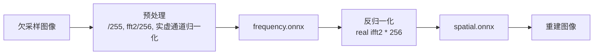

## 模型概述
```
- 任务：8%~10%极稀疏采样傅里叶单像素成像重建
- 网络：频域空域联合重构，编码器加入cross-attention，约束损失增强高频细节
- 训练指标（训练端，非部署实测）：SSIM+5.87%，PSNR+6.53%，增加1.768dB
- 部署链路：TensorRT不支持IFFT算子，拆分为`frequency.onnx` + `spatial.onnx`，中间FP32 IFFT衔接；固定输入`batch=1,256×256`
- 模型版本：lighta_dual_logmagphase70_mse_ssim10_w075_l2_rcca2_e50
<details>
<summary>查看模型版本命名说明</summary>

| 字段 | 含义 |
|---|---|
| `lighta_dual` | LightA频域—空域双域网络 |
| `logmagphase70` | 频域幅值与相位损失，权重为0.7 |
| `mse_ssim10` | 空域使用MSE与SSIM损失，SSIM权重为0.1 |
| `w075` | 网络宽度倍率为0.75 |
| `l2` | 每个网络块包含2层 |
| `rcca2` | 频域和空域均执行2次RCCA循环 |
| `e50` | 最大训练轮数为50个epoch |

`best.hdf5`为验证集指标最优的权重，不一定来自第50轮。

</details>



## 目录结构

```
.
├── models/            # frequency.onnx, spatial.onnx, manifest.json
├── calibration/       # INT8校准张量（测试用16张） + calibration_index.csv
├── calibration_cache/ # INT8校准缓存（构建生成）
├── engines/           # .engine文件，平台绑定，未上传git（运行后生成）
├── scripts/           # 构建&推理脚本
├── test_data/         # input欠采样图，reference全采样GT
├── benchmark/         # trtexec延迟json（运行后生成）
├── log/               # 运行日志（运行后生成）
├── output_fp16/ output_int8/ output_fp32/ #推理输出
└── package_manifest.json
```

## 环境（2026-09-9版本）

| 项目 | 版本 |
| --- | --- |
| 硬件 | NVIDIA Jetson Xavier NX Developer Kit |
| JetPack/L4T | JetPack 5.1.6（L4T R35.6.4） |
| TensorRT | 8.5.2.2 |
| numpy | 1.22.4 |
| pycuda | 2022.2.2 |
| onnxruntime-gpu | 1.7.0 |

- `.engine`平台强绑定，**禁止跨设备拷贝，必须Jetson本地构建**
- 环境校验命令：`python3 -c "import pycuda.driver, tensorrt; print('OK')"`

## 快速复现

```
git clone https://github.com/nanmunan826/lightA-DUAL.git
cd lightA-DUAL

# 环境校验
python3 -c "import tensorrt as trt; print(trt.__version__)"
/usr/src/tensorrt/bin/trtexec --version

# 构建FP16基线engine
/usr/src/tensorrt/bin/trtexec --onnx=models/frequency.onnx --saveEngine=engines/frequency_fp16.engine --fp16 --verbose
/usr/src/tensorrt/bin/trtexec --onnx=models/spatial.onnx --saveEngine=engines/spatial_fp16.engine --fp16 --verbose

# 构建INT8 engine（校准张量已内置仓库（仓库仅提供16张校准包测试用，如想完整复现本文结果需使用800张校准包））
python3 scripts/jetson_build_int8.py --onnx=models/frequency.onnx --calibration=calibration/frequency_input_float32.npy --cache=calibration_cache/frequency.cache --engine=engines/frequency_int8.engine
python3 scripts/jetson_build_int8.py --onnx=models/spatial.onnx --calibration=calibration/spatial_input_float32.npy --cache=calibration_cache/spatial.cache --engine=engines/spatial_int8.engine

# 基础推理
python3 scripts/jetson_infer_trt.py --package-dir . --input test_data/input --output-dir output_int8 --precision int8

# 生成校准包（可用于生成800张校准包）
python3 calibration/prepare_jetson_package.py \
  --run-dir Models/checkpoints/<model_name> \
  --onnx-dir Deployment/<onnx_model_dir>/models \
  --output-dir Deployment/<output_package_name> \
  --calibration-count 800 \
  --seed 905 \
  --test-metrics path/to/per_image.csv
```
## 脚本版本说明

> 
> 测速、精度脚本不可混用；不同脚本 SSIM/PSNR 计算口径存在差异，指标对比必须固定同一份脚本

1. **V1 jetson_infer_trt.py**：基础推理，无计时、无精度对比，仅验证链路通断
2. **V2 jetson_infer_trt_latency.py**：增加推理计时，该推理计时未作I/O优化,内置 ONNX 精度对比逻辑
   - 注意ONNX 对比依赖`onnxruntime-gpu==1.7.0`，Jetson aarch64 官方预编译包难以下载,可通过u盘拷贝到jetson或通过梯子下载；脚本推理计时正常，仅该子功能失效
3. **V3 jetson_infer_trt_latency_fast.py【测速专用】**
   - 新增图片预加载、异步存图、PNG 压缩、warmup 预热、FP32 基线对比
   - 该版本不计算 SSIM/PSNR/RMSE，不输出 npy、metrics.csv
4. **V4 jetson_infer_trt_latency_ssim.py【精度评测专用】**（继承 V3 全部优化）
   - GT 真值评估，输出`reconstructions_*.npy`与`metrics_*.csv`，含 PSNR、SSIM、RMSE
## 性能测试命令

### 速度测试（fast脚本）

```
# INT8 优化测速
timeout 600 python3 scripts/jetson_infer_trt_latency_fast.py --package-dir . --input test_data/input --output-dir output_int8 --precision int8 | tee log/infer_int8_optimized.log
# FP16 优化测速
timeout 600 python3 scripts/jetson_infer_trt_latency_fast.py --package-dir . --input test_data/input --output-dir output_fp16 --precision fp16 | tee log/infer_fp16_optimized.log
```

### 精度评测（ssim脚本）

```
# INT8，带FP32基线对比（量化损失）
timeout 900 python3 scripts/jetson_infer_trt_latency_ssim.py --package-dir . --input test_data/input --output-dir output_int8 --precision int8 --baseline-fp32 | tee log/infer_int8_gt.log
# FP16 / FP32 只对比GT，去掉--baseline-fp32
timeout 900 python3 scripts/jetson_infer_trt_latency_ssim.py --package-dir . --input test_data/input --output-dir output_fp16 --precision fp16 | tee log/infer_fp16_gt.log
```

### ssim脚本完整命令行参数列表
| 参数 | 类型 | 必填 | 默认值 | 说明 |
|------|------|------|--------|------|
| `package-dir` | Path | 是 | — | 项目根目录，包含 `models/`、`engines/` |
| `input` | Path | 是 | — | 输入图像或目录（本模型中是欠采样图像目录） |
| `output-dir` | Path | 是 | — | 输出目录（npy、CSV、可选 PNG） |
| `precision` | choice | 否 | `int8` | `fp32` / `fp16` / `int8` |
| `baseline-fp32` | flag | 否 | 不启用 | 启用 FP32 基准对比 |
| `warmup` | int | 否 | `10` | 预热图片数量 |
| `reference-dir` | Path | 否 | 自动推导 | GT 目录（全采样图像目录），默认 `<input_parent>/reference` |
| `save-png` | flag | 否 | 不启用 | 是否保存重建 PNG |

## 输出说明

- `reconstructions_*.npy`：全部重建图像数组，shape `(1176,256,256)`
- `metrics_*.csv`：逐图指标 PSNR / SSIM / RMSE
- 指标区分：
  1. vs GT：重建图像与全采样真值对比，表征模型重建质量
  2. vs FP32 baseline：INT8与FP32推理结果对比，表征量化损失


## 实测基准（Xavier NX，1176张）

| 配置 | no_io延迟(ms) | with_io延迟(ms) | PSNR(dB,vsGT) | SSIM(vsGT) | FPS |
| --- | --- | --- | --- | --- | --- |
| FP32 | 49.06 | 52.01 | 28.8775 | 0.8734 | 20.38 |
| FP16 | 34.70 | 37.95 | 28.8772 | 0.8734 | 28.82 |
| INT8 | 30.79 | 33.79 | 28.4781 | 0.8667 | 32.48 |

> 
> 量化损失：INT8相对FP32，PSNR损失仅0.40dB，SSIM损失0.007，量化几乎无损。需注意该测试是基于800张校准集校准后模型测得。

## 已知问题

1. 频域、空域engine必须使用各自校准张量，不可混用。
2. Xavier NX显存有限，开启`--baseline-fp32`容易OOM；可关闭图形界面释放显存。
3. 大批量跑数据集偶现`NvMapMemAllocInternalTagged error 12`，为统一内存分配失败，属于硬件资源限制，非算法bug。


